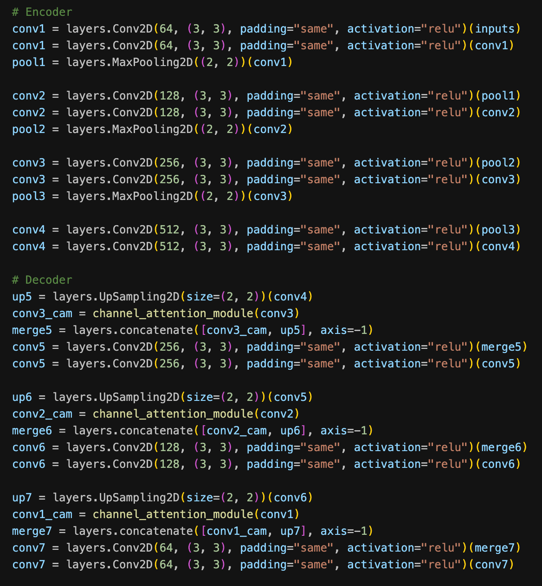
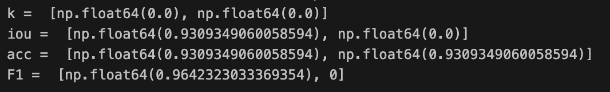
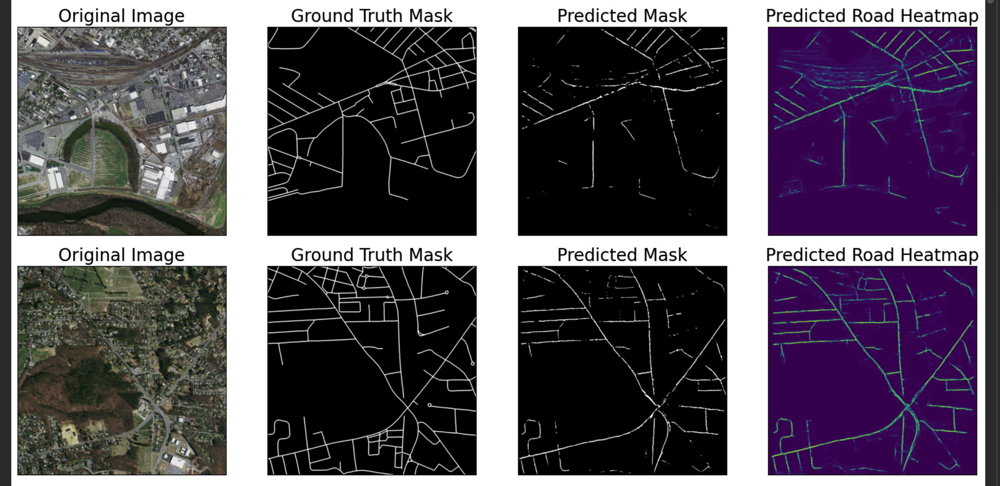
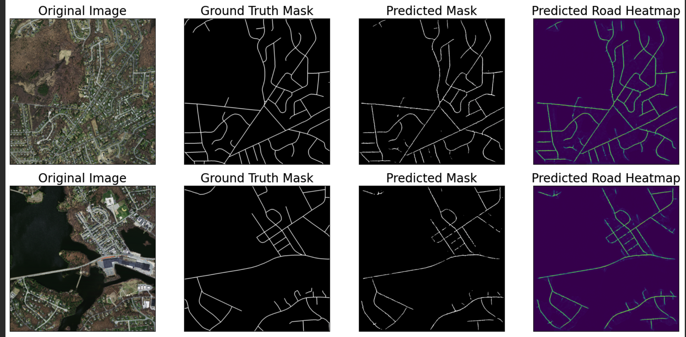
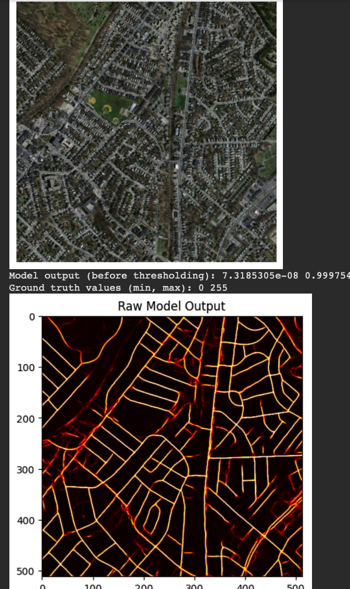
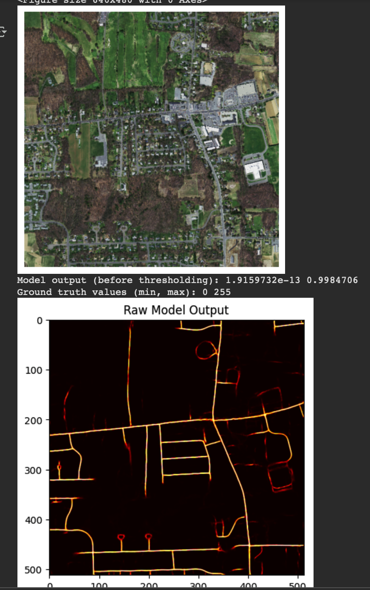

# 🛣️ Road Segmentation Project

This repository contains a project focused on **road segmentation** using deep learning techniques.  
The goal is to automatically identify and segment road regions from satellite or street-view images.

---

## 📘 Project Overview

Road segmentation plays a vital role in applications such as:
- Autonomous driving  
- Urban planning  
- Map generation  
- Infrastructure monitoring  

In this project, we implemented and compared different deep learning models for road segmentation, visualizing and evaluating their performance.

---

## 🧠 Methodology

1. **Data Preparation** – Loaded and preprocessed the road dataset (resizing, normalization, and mask generation).  
2. **Model Architecture** – Used a convolutional neural network (CNN)-based segmentation model.
  Here I used CAM -7 architecture, I was just doing exprementation on Unet. Just added channel attention module in all decoder blocks.
   
    
   
4. **Training** – Trained on labeled road datasets with data augmentation.  
5. **Evaluation** – Compared performance using IoU and pixel accuracy metrics.
    
7. **Visualization** – Generated segmented road masks and visualized predictions.

---

## 🖼️ Results

Here are some examples of the segmentation outputs:







---

## ⚙️ Requirements

To run the notebooks, install the following dependencies:

```bash
pip install numpy pandas matplotlib tensorflow keras opencv-python scikit-learn
